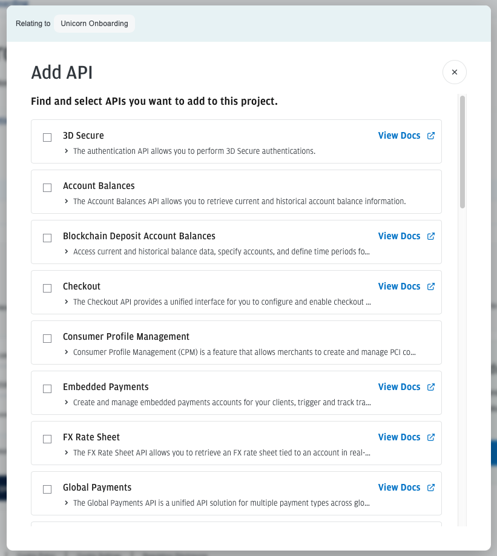

# JPMorgan Validation Services API Integration

## Introduction

This project is a Python-based integration with the JPMorgan Validation Services API. The API provides capabilities to verify US bank accounts and global accounts, ensuring the validity and authenticity of the account information. This integration is essential for businesses that need to validate bank account details to prevent fraud and ensure smooth financial transactions.

This README and project was generated in 60 mins leveraging the Payments Developer Portal and the API documentation along with GitHub Copilot.

https://developer.payments.jpmorgan.com/docs/fraud-solutions/validation-services/capabilities/account-validation/how-to/verify-a-bank-account

https://developer.payments.jpmorgan.com/api/fraud-solutions/validation-services/validation-services#/operations/accountValidation


## Core Use Cases

### 1. Verify a US Bank Account
This use case allows you to verify the details of a US bank account. The API checks the validity of the account number and other related information to ensure that the account is legitimate and active.

#### Scenarios:
- **Verify if an account exists and is active**: Ensure the account is valid and currently active.
- **Verify if an account is likely to result in a debit return**: Check the likelihood of a debit return for the account.
- **Validate the account status along with the beneficiary**: Confirm the account status and the associated beneficiary details.

### 2. Verify a Global Account
This use case enables the verification of bank accounts outside the US. The API validates the account details against international standards and ensures the account is valid and can be used for transactions.

#### Scenarios:
- **Verify and authenticate a personal bank account**: Confirm the validity and authenticity of a personal bank account.
- **Verify and authenticate a business bank account**: Confirm the validity and authenticity of a business bank account.

## Getting Started

### Prerequisites
- Python 3.7 or higher
- `requests` library

#### Retrieving the Status of a Validation Services Request
To retrieve the status of a Validation Services request, you will need the following:
- A registered and fully onboarded Developer Account on the [J.P. Morgan Payments Developer Portal](https://developer.payments.jpmorgan.com/docs/quick-start).
- An active project that provides you with the credentials to make a request.


### Installation
1. Clone the repository:
   ```sh
   git clone https://github.com/yourusername/jpmorgan-validation-services.git
   cd jpmorgan-validation-services
   ```

2. Install the required dependencies:
   ```sh
   python3 -m venv venv
   source venv/bin/activate
   pip install -r requirements.txt
   ```

### Configuration
1. Obtain your API credentials from the J.P. Morgan Payments Developer Portal.
2. Create a `.env` file in the project root and add your API credentials:
   ```env
   JPM_CLIENT_ID=your_client_id
   JPM_CLIENT_SECRET=your_client_secret
   ```

### Usage
Run the `main.py` script to execute the example usage scenarios:
   ```sh
    python main.py
   ```

## Testing
To run tests, use the following command:
```sh
pytest
```

## Contributing
Contributions are welcome! Please open an issue or submit a pull request.

## License
This project is licensed under the MIT License. See the `LICENSE` file for details.

## Issues/Enhancements found in Payments Developer Portal

1. Curl command on Project page is missing required params
Currently:
   ``` shell
   > curl https://id.payments.jpmorgan.com/am/oauth2/alpha/access_token --user "<client id>" --data "grant_type=client_credentials" --data "scope=jpm:payments:sandbox"
   > {"error_description":"Client authentication failed","error":"invalid_client"}%   
   ```
should be:
   ``` shell
   > curl --location 'https://id.payments.jpmorgan.com/am/oauth2/alpha/access_token' --header 'Content-Type: application/x-www-form-urlencoded' --data-urlencode 'grant_type=client_credentials' --data-urlencode 'scope=jpm:payments:sandbox' --data-urlencode 'client_id=<client_id>' --data-urlencode 'client_secret=<client_secret>'
   ```

2. Why does the add API menu not match all the other menu/product structures? And why can't I search the list of APIs?

I was expecting to see it tiered by the Trust and Safety - Validation services but its just a flat list of APIs.



3. While creating a new project on PDP - why do you not default the person creating the project as a member of the project?

4. As an external developer I found myself needing to use a combination of the OAS specification (downloaded), the quick start guide and the Curl examples to generate code that works. It would be awesome to have this all in sync.

5. I am missing many edge case scenarios that I would want to be able to test for - even the scenarios detailed in the documentation are not covered.

6. The API documentation is very detailed and helpful but I found myself needing to go back and forth between the API documentation and the quick start guide to get the full picture. It would be great to have a single page that has all the information needed to get started. Tailored to a specific API.


